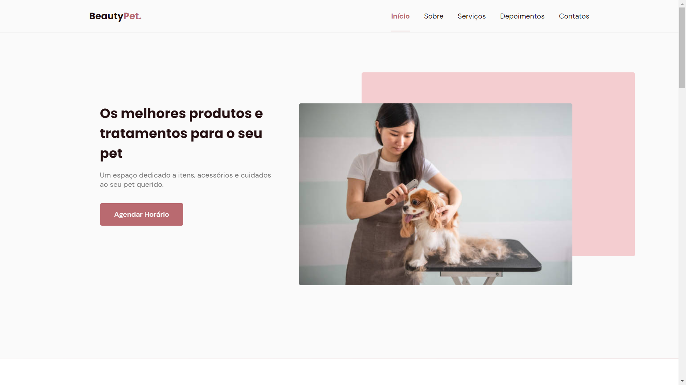

# Beauty-pet

  <a href="">Acesse o site</a>&nbsp;&nbsp;&nbsp;|&nbsp;&nbsp;&nbsp;
  <a href="#-tecnologias">Tecnologias</a>&nbsp;&nbsp;&nbsp;|&nbsp;&nbsp;&nbsp;
  <a href="#-projeto">Projeto</a>&nbsp;&nbsp;&nbsp;|&nbsp;&nbsp;&nbsp;
  <a href="#-milhas-extras">Milhas extras</a>&nbsp;&nbsp;&nbsp;|&nbsp;&nbsp;&nbsp;
  <a href="#-layout">Layout</a>&nbsp;&nbsp;&nbsp;|&nbsp;&nbsp;&nbsp;

 

<h1 align="center">
  
</h1>

## 🚀 Tecnologias

Esse projeto foi desenvolvido com as seguintes tecnologias:

- HTML
- CSS
- JavaScript

  

## 💻 Projeto

O BeutyPet é um site que pode ser adaptado para diversas necessidades, pois conta com várias sessões que servem para mostrar ao mundo todo o conteúdo que sua empresa possui. Neste exemplo ele está adaptado para um PetShop, que possui serviços de beleza para o seus pets, acessórios e itens vitais para cuidar do seu amiguinho(a).

  

## 🚆 Milhas extras

- Trabalhar na responsividade de mais dispositivos: concluído em:
- Adição de arquivo com configuração para cache: concluído em 02/11/2021 :heavy_check_mark:

## 🔖 Layout

Você pode visualizar o layout do projeto através [desse link](https://www.figma.com/community/file/1009807319507822993/Origin-Six). É necessário ter conta no [Figma](https://figma.com) para acessá-lo.
